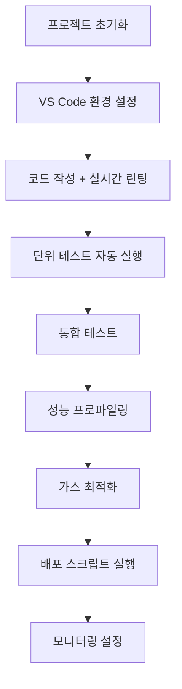

# 🔧 개발자 도구 (Developer Tools)

Movement 개발을 더욱 효율적으로 만드는 고급 도구들과 워크플로우를 알아보겠습니다. 생산성을 극대화하고 코드 품질을 향상시키는 방법을 제공합니다.

## 🎯 학습 목표

이 섹션을 완료하면:
- Movement CLI의 모든 고급 기능을 활용할 수 있습니다
- IDE 환경을 최적화하여 개발 속도를 높일 수 있습니다
- 효과적인 디버깅 기법을 사용할 수 있습니다
- 자동화된 테스트와 배포 파이프라인을 구축할 수 있습니다
- 성능 분석과 최적화를 수행할 수 있습니다

## 🛠️ 도구 카테고리

### 1. [Movement CLI 상세 가이드](/developer-tools/movement-cli-guide)
CLI의 모든 고급 기능과 워크플로우:
- **프로젝트 관리** - 복합 프로젝트, 워크스페이스 관리
- **고급 빌드 옵션** - 최적화, 병렬 처리, 캐싱
- **네트워크 관리** - 커스텀 네트워크, 프록시 설정
- **스크립팅** - 자동화 스크립트, 배치 처리
- **프로파일링** - 성능 측정, 가스 분석

### 2. [SDK 모음 (TypeScript, Python, Rust)](/developer-tools/sdk-collection)
다양한 언어로 Movement와 상호작용:
- **TypeScript SDK** - 웹 dApp, 프론트엔드 개발
- **Python SDK** - 데이터 분석, 백엔드 서비스
- **Rust SDK** - 고성능 애플리케이션 개발
- **크로스 SDK 도구** - 언어 간 마이그레이션
- **실전 프로젝트** - 멀티 SDK 아키텍처

### 3. [Wallet 연동 도구](/developer-tools/wallet-integration)
주요 Movement 지갑들과의 완벽한 연동:
- **Razor Wallet** - Movement 네이티브 지갑
- **Nightly** - 멀티체인 지원 지갑
- **WalletConnect** - 모바일 지갑 연결 프로토콜
- **통합 지갑 관리** - 멀티 지갑 지원 dApp
- **보안 고려사항** - 안전한 연동 패턴

### 4. [개발 환경 (VS Code/IntelliJ)](/developer-tools/ide-setup)
최적화된 IDE 환경 구성:
- **VS Code 완전 설정** - 확장, 설정, 디버깅
- **IntelliJ IDEA 설정** - Move 플러그인, 프로젝트 구성
- **고급 워크플로우** - 자동화, 키보드 단축키
- **팀 협업 설정** - 공유 설정, Git 통합
- **성능 최적화** - IDE 성능 튜닝

### 5. [디버깅 & 모니터링](/developer-tools/debugging-tools)
효과적인 문제 해결과 시스템 모니터링:
- **기본 디버깅** - 컴파일 에러, 런타임 에러 해결
- **트랜잭션 추적** - 실행 과정 상세 분석
- **성능 프로파일링** - 병목 지점 식별
- **실시간 모니터링** - 메트릭 수집, 알람 시스템
- **에러 해결 가이드** - 일반적인 문제 해결법

### 6. [테스트 프레임워크](/developer-tools/testing-framework)
포괄적인 테스트 전략과 자동화:
- **단위 테스트** - Move 모듈 테스트, TDD 방식
- **통합 테스트** - 모듈 간 상호작용 테스트
- **E2E 테스트** - 전체 시스템 테스트
- **테스트 자동화** - CI/CD 파이프라인 구축
- **품질 메트릭** - 커버리지, 성능 벤치마크

## ⚡ 개발 워크플로우 최적화

### 효율적인 개발 환경
```bash
# 개발 환경 설정 스크립트
#!/bin/bash
echo "=== Movement 개발 환경 최적화 ==="

# CLI 최신 버전 설치
curl -LO https://github.com/movementlabsxyz/aptos-core/releases/latest/movement-cli.tar.gz
tar -xzf movement-cli.tar.gz && sudo mv movement /usr/local/bin/

# VS Code 확장 자동 설치
code --install-extension move-language-extension
code --install-extension rust-lang.rust-analyzer

# 개발 별칭 설정
echo "alias mvb='movement move build'" >> ~/.bashrc
echo "alias mvt='movement move test'" >> ~/.bashrc
echo "alias mvp='movement move publish'" >> ~/.bashrc

echo "환경 설정 완료! 🚀"
```

### 프로젝트 템플릿
```bash
# 고급 프로젝트 템플릿 생성
movement create-workspace my-dapp-workspace
cd my-dapp-workspace

# 멀티 패키지 구조
movement move init contracts/core
movement move init contracts/tokens  
movement move init contracts/nft
movement move init tests/integration
```

## 🎮 실전 도구 활용 예시

### DeFi 프로젝트 개발 워크플로우


### NFT 마켓플레이스 도구체인
```bash
# NFT 프로젝트 개발 스택
project/
├── contracts/           # 스마트 계약
├── tests/              # 테스트 스위트
├── scripts/            # 자동화 스크립트
├── monitoring/         # 모니터링 도구
└── .vscode/           # IDE 설정
    ├── settings.json
    ├── launch.json
    └── tasks.json
```

## 💡 생산성 향상 팁

### 1. 단축키와 별칭 설정
```bash
# ~/.bashrc 또는 ~/.zshrc에 추가
alias mvdev='movement move test && movement move build'
alias mvdeploy='movement move publish --account-name dev-account'
alias mvstatus='movement account balance && movement config show'

# VS Code 단축키 (settings.json)
{
    "keyboard.shortcuts": [
        {
            "key": "ctrl+shift+b",
            "command": "workbench.action.terminal.sendSequence",
            "args": {"text": "movement move build\n"}
        }
    ]
}
```

### 2. 자동 코드 품질 관리
```yaml
# .github/workflows/quality.yml
name: Code Quality
on: [push, pull_request]
jobs:
  quality-check:
    runs-on: ubuntu-latest
    steps:
      - uses: actions/checkout@v3
      - name: Movement CLI Setup
        run: # CLI 설치 스크립트
      - name: Lint Check
        run: movement move check
      - name: Test Coverage
        run: movement move test --coverage --minimum 90
      - name: Security Scan
        run: movement security-scan sources/
```

### 3. 실시간 모니터링 대시보드
```javascript
// monitoring/dashboard.js
const express = require('express');
const { exec } = require('child_process');

const app = express();
app.get('/status', async (req, res) => {
    // Movement 네트워크 상태 확인
    exec('movement config show', (error, stdout) => {
        res.json({
            network: stdout,
            timestamp: new Date(),
            status: error ? 'error' : 'ok'
        });
    });
});
```

## 🚀 고급 기능 미리보기

### 멀티체인 개발 환경
```toml
# Move.toml - 멀티체인 설정
[package]
name = "multichain-dapp"

[networks.movement-testnet]
rpc = "https://testnet.bardock.movementnetwork.xyz/v1"
chain-id = 177

[networks.movement-mainnet]  
rpc = "https://mainnet.movementnetwork.xyz/v1"
chain-id = 126
```

### AI 지원 코드 생성
```bash
# Cursor AI 또는 GitHub Copilot 활용
# Move 코드 패턴 자동 완성
# 테스트 케이스 자동 생성
# 문서 자동 생성
```

### 실시간 협업 도구
```bash
# Git 워크플로우 최적화
git config --global alias.mvcommit '!f() { movement move test && git add . && git commit -m "$1"; }; f'
git config --global alias.mvpush '!f() { git mvcommit "$1" && git push; }; f'
```

## 🎯 도구별 숙련도 체크리스트

### 초급 (Beginner)
- [ ] Movement CLI 기본 명령어 사용
- [ ] VS Code 기본 설정 완료
- [ ] 기본 테스트 작성 및 실행
- [ ] 간단한 빌드 스크립트 작성

### 중급 (Intermediate)  
- [ ] CLI 고급 옵션 활용
- [ ] 커스텀 디버깅 설정 구성
- [ ] 성능 프로파일링 수행
- [ ] CI/CD 파이프라인 구축

### 고급 (Advanced)
- [ ] 멀티패키지 프로젝트 관리
- [ ] 고급 테스트 전략 구현
- [ ] 커스텀 도구 개발
- [ ] 팀 워크플로우 최적화

## 🔗 학습 경로

각 도구를 단계별로 학습해보세요:

1. **[Movement CLI 상세 가이드](/developer-tools/movement-cli-guide)** - 모든 것의 기초
2. **[개발 환경 (VS Code/IntelliJ)](/developer-tools/ide-setup)** - 개발 환경 최적화  
3. **[SDK 모음 (TypeScript/Python/Rust)](/developer-tools/sdk-collection)** - 언어별 개발 도구
4. **[Wallet 연동 도구](/developer-tools/wallet-integration)** - 지갑 통합
5. **[디버깅 & 모니터링](/developer-tools/debugging-tools)** - 문제 해결 능력 향상
6. **[테스트 프레임워크](/developer-tools/testing-framework)** - 코드 품질 보장

## 📚 추가 리소스

### 공식 도구들
- [Movement 개발자 포털](https://developer.movementnetwork.xyz/)
- [Movement 공식 문서](https://docs.movementnetwork.xyz/)
- [Movement GitHub](https://github.com/movementlabsxyz)

### 커뮤니티 도구들
- **Move Analyzer** - 정적 분석 도구
- **Move Formatter** - 코드 포맷팅 도구
- **Movement Package Manager** - 패키지 관리 도구
- **Community Templates** - 커뮤니티 제작 템플릿

---

*올바른 도구를 사용하면 개발이 즐거워집니다! 🛠️✨*